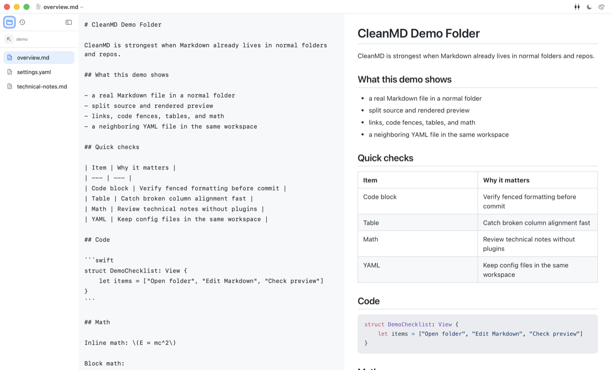
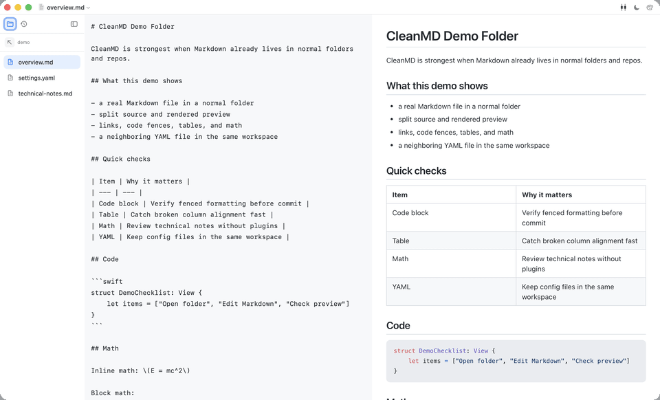

# CleanMD

Native macOS Markdown editing for people who want local files, split preview, and a lighter workflow than a full knowledge base.

CleanMD is a native macOS Markdown editor for folders and repos you already have. Open a file, keep the source and rendered result side by side, and verify code fences, tables, links, math, and adjacent YAML without a plugin stack.

## Website

The public website lives in `docs/` and is intended for GitHub Pages.

- Overview page: `https://hosioobo.github.io/CleanMD/`
- Tracked download route: `https://hosioobo.github.io/CleanMD/download/`
- GitHub Releases fallback: `https://github.com/hosioobo/CleanMD/releases/latest`

## What CleanMD is good at

- Native macOS app built with SwiftUI and AppKit
- File explorer, editor, and live preview in one window
- Folder and History tabs for local navigation
- Syntax highlighting for fenced code blocks
- KaTeX-powered math rendering
- YAML files rendered as formatted code with preserved indentation
- Optional synchronized scrolling between editor and preview
- Offline bundled renderer assets
- Opens `.md`, `.markdown`, `.yml`, and `.yaml`
- Drag and drop for supported text documents

## Current app captures

The first two screenshots are the existing light and dark captures. The third uses the repo-local `demo/` folder so the visible files and content are easy to reproduce.

### Light mode


### Dark mode


### Demo folder



## Short demo

The demo below is assembled from real CleanMD window captures using the files in `demo/`.



Download the MP4: [`docs/assets/demo/cleanmd-demo-folder.mp4`](docs/assets/demo/cleanmd-demo-folder.mp4)

## Demo source files

Use these repo-local files when you want to reproduce the current README and website media:

- `demo/overview.md`
- `demo/settings.yaml`
- `demo/technical-notes.md`

## Requirements

- macOS 13 or later
- Xcode command line tools for local builds

## Download

Regular users should start with the website or GitHub Releases:

- Website overview: `https://hosioobo.github.io/CleanMD/`
- Primary download path: `https://hosioobo.github.io/CleanMD/download/`
- GitHub Releases fallback: `https://github.com/hosioobo/CleanMD/releases/latest`

### Run the app

1. Download the latest release from the website or GitHub Releases.
2. Unzip the downloaded `CleanMD-v*.zip` file.
3. Move `CleanMD.app` to your Applications folder if desired.
4. Open `CleanMD.app`.

CleanMD is currently packaged and ad-hoc signed, but not notarized yet. If macOS pauses the first launch, Control-click the app, choose `Open`, and confirm once.

## Build from source

```bash
swift build --disable-sandbox -c release
./scripts/run-smoke-tests.sh
NO_OPEN=1 ./build.sh
```

This project is built with Swift Package Manager and a shell packaging script. `./build.sh` builds the executable, packages `CleanMD.app` in the repository root, copies the bundled assets, applies ad-hoc signing, and launches the app. Use `NO_OPEN=1` to skip launching the app in headless or sandboxed environments.

## Project structure

- `CleanMD/`: Swift source files and bundled preview assets
- `demo/`: reproducible Markdown and YAML files used for current screenshots and demo media
- `docs/`: GitHub Pages website and download route
- `build.sh`: local packaging script for `CleanMD.app`
- `Info.plist`: app metadata and document type registration
- `makeicon.swift`: script used to generate app icon assets

## Contributing

```bash
git clone git@github.com:hosioobo/CleanMD.git
cd CleanMD
swift build
./build.sh
```

Please keep the app lightweight and offline-friendly. If you change bundled third-party assets, update `THIRD_PARTY_NOTICES.md`.

## Release notes

- See [`CHANGELOG.md`](CHANGELOG.md) for the in-repo release history.
- See GitHub Releases for the packaged downloads and published release pages.

## Versioning and releases

- Versioning policy and release checklist: [`VERSIONING.md`](VERSIONING.md)
- Prepare release metadata: `./scripts/prepare-release.sh <version> <build>`
- Build a versioned release zip: `./scripts/package-release.sh`
- Run the full GitHub release flow: `./scripts/release.sh <version> <build>`
- Create the GitHub Release: `./scripts/create-github-release.sh <version>`
- CI runs on GitHub Actions via [`.github/workflows/ci.yml`](.github/workflows/ci.yml)

## License

CleanMD is available under the MIT license. See `LICENSE`.
