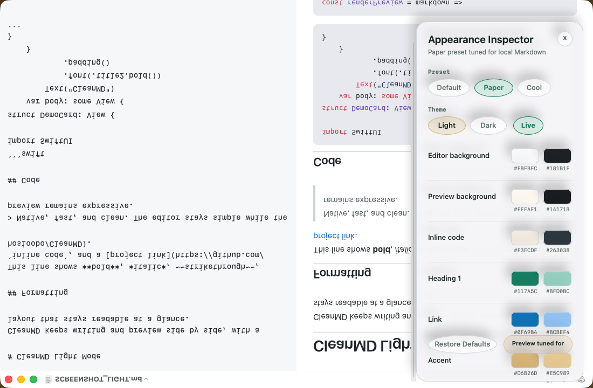
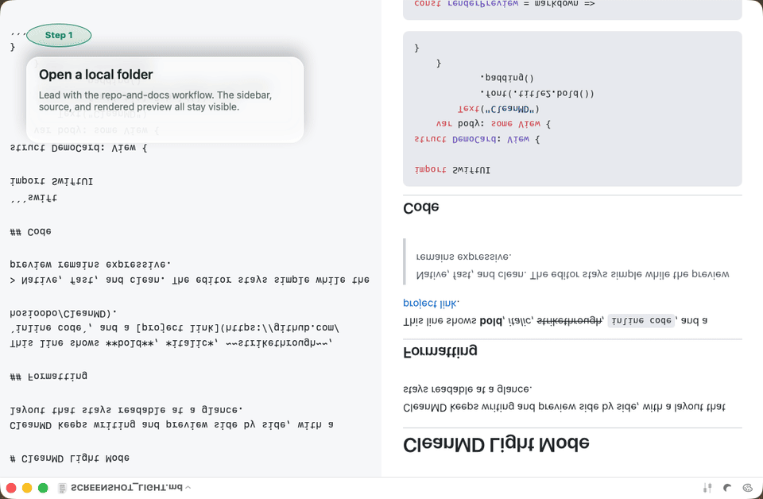

# CleanMD

Native macOS Markdown editing for people who want local files, split preview, and a lighter workflow than a full knowledge base.

CleanMD is a native macOS Markdown editor built for people who already keep Markdown in folders and repos. Open a folder, edit Markdown, and check the rendered result side by side. Code blocks, tables, links, and math stay easy to verify without vault setup or a plugin stack.

## Website

The public website lives in `docs/` and is intended for GitHub Pages:

- Overview page: `https://hosioobo.github.io/CleanMD/`
- Tracked download route: `https://hosioobo.github.io/CleanMD/download/`
- GitHub Releases fallback: `https://github.com/hosioobo/CleanMD/releases/latest`

The tracked `/download/` page resolves the newest GitHub release asset at runtime, so the public download button can stay stable while release zip names remain versioned.

## Features

Best for READMEs, specs, release notes, docs, and notes that need to stay as plain files.

- Native macOS app built with SwiftUI and AppKit
- Three-pane layout with file explorer, editor, and live preview
- Folder and History explorer tabs with icon-first navigation
- Syntax highlighting for fenced code blocks
- KaTeX-powered math rendering
- YAML files render in a code preview with preserved indentation
- Optional synchronized scrolling between editor and preview
- Offline-first bundled renderer assets
- Opens `.md`, `.markdown`, `.yml`, and `.yaml` files
- Drag and drop supported text documents into the app
- Docked appearance inspector with live palette editing
- Built-in appearance presets: Default, Paper, and Cool

## Screenshots

Use the two bundled screenshot documents so light mode and dark mode each show a different part of the app without scrolling:

- `SCREENSHOT_LIGHT.md`
- `SCREENSHOT_DARK.md`

Recommended captures:

- light mode full split view using `SCREENSHOT_LIGHT.md`
- dark mode full split view using `SCREENSHOT_DARK.md`
- appearance inspector with the Paper preset and live palette controls visible
- short proof demo exported from `./scripts/build-launch-assets.sh`

### Light Mode


### Dark Mode


### Appearance Inspector



## Demo

The launch proof kit includes a short 24-second walkthrough that follows the approved GTM sequence from folder open to download CTA.



Download the MP4: [`docs/assets/demo/cleanmd-proof-demo.mp4`](docs/assets/demo/cleanmd-proof-demo.mp4)

Surface-by-surface asset notes live in [`docs/launch-assets.md`](docs/launch-assets.md).

## Requirements

- macOS 13 or later
- Xcode command line tools for local builds

## Download

Download the latest GitHub Release if you want the packaged app, or build from source if you prefer a local developer path.

Regular users should start with the website and primary tracked download path:

- Website overview: `https://hosioobo.github.io/CleanMD/`
- Primary download path: `https://hosioobo.github.io/CleanMD/download/`
- GitHub Releases fallback: `https://github.com/hosioobo/CleanMD/releases/latest`

### Run the App

1. Download the latest release from the website or GitHub Releases.
2. Unzip the downloaded `CleanMD-v*.zip` file.
3. Move `CleanMD.app` to your Applications folder if desired.
4. Open `CleanMD.app`.

Early releases are packaged and ad-hoc signed for convenience, but they are not notarized yet. macOS Gatekeeper may show a warning the first time you open the app, so use Control-click -> `Open` on first launch if needed.

## Build From Source

```bash
swift build --disable-sandbox -c release
./scripts/run-smoke-tests.sh
NO_OPEN=1 ./build.sh
```

This project is built with Swift Package Manager and a shell packaging script — there is no Xcode project required. `./build.sh` builds the executable, packages `CleanMD.app` in the repository root, copies the bundled web assets, applies ad-hoc signing, and launches the app. Use `NO_OPEN=1` to skip launching the app in headless or sandboxed environments.

## Project Structure

- `CleanMD/`: Swift source files and bundled preview assets
- `docs/`: GitHub Pages website, tracked download route, and lightweight client-side analytics
- `docs/launch-assets.md`: publish-ready proof asset map for website, README, release page, and `r/macapps`
- `build.sh`: local packaging script for `CleanMD.app`
- `scripts/build-launch-assets.sh`: regenerate the launch screenshots, proof grids, and demo assets
- `Info.plist`: app metadata and document type registration
- `makeicon.swift`: script used to generate app icon assets

## Contributing

```bash
git clone git@github.com:hosioobo/CleanMD.git
cd CleanMD
swift build
./build.sh
```

Please keep the app lightweight and offline-friendly. If you change bundled third-party assets, update the notices in `THIRD_PARTY_NOTICES.md`.

## Release Notes

- See [`CHANGELOG.md`](CHANGELOG.md) for recent updates after the first release.
- See [`RELEASE_NOTES_v0.10.0.md`](RELEASE_NOTES_v0.10.0.md) for the latest feature release notes.
- See [`RELEASE_NOTES_v0.9.0.md`](RELEASE_NOTES_v0.9.0.md) for the previous feature release notes.
- See [`RELEASE_NOTES_v0.8.0.md`](RELEASE_NOTES_v0.8.0.md) for the older feature release notes.
- See [`RELEASE_NOTES_v0.7.0.md`](RELEASE_NOTES_v0.7.0.md) for the first public release notes.

## Versioning and Releases

- Versioning policy and release checklist: [`VERSIONING.md`](VERSIONING.md)
- Prepare release metadata: `./scripts/prepare-release.sh <version> <build>`
- Build a versioned release zip: `./scripts/package-release.sh`
- Run the full GitHub release flow: `./scripts/release.sh <version> <build>`
- Create the GitHub Release: `./scripts/create-github-release.sh <version>`
- CI runs on GitHub Actions via [`.github/workflows/ci.yml`](.github/workflows/ci.yml)

## License

CleanMD is available under the MIT license. See `LICENSE`.
