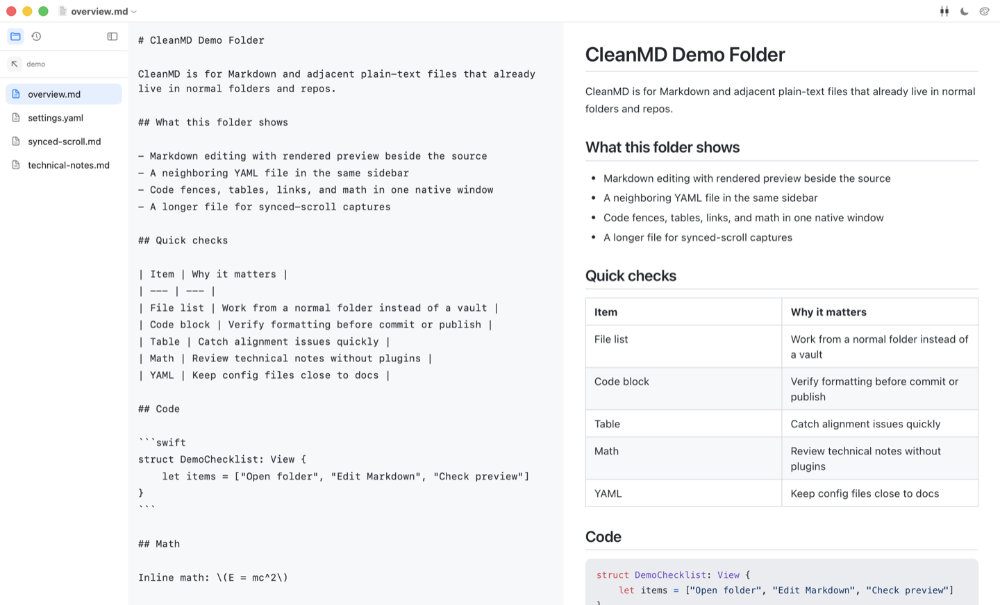
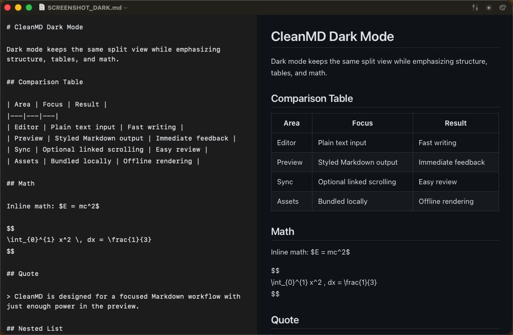

# CleanMD

The lightest, fastest, cleanest native macOS Markdown editor.

CleanMD is a native macOS Markdown editor focused on speed, simplicity, and a clean split-view writing experience. It pairs a plain text editor with a live preview, supports code highlighting and math rendering, and works fully offline with bundled rendering assets.

## Features

- Native macOS app built with SwiftUI and AppKit
- Three-pane layout with file explorer, editor, and live preview
- Folder and History explorer tabs with icon-first navigation
- Syntax highlighting for fenced code blocks
- KaTeX-powered math rendering
- YAML files render in a code preview with preserved indentation
- Optional synchronized scrolling between editor and preview
- Offline-first bundled renderer assets
- Opens `.md`, `.markdown`, `.yml`, and `.yaml` files
- Drag and drop supported text documents into the app
- Customizable preview color palette and heading dividers

## Screenshots

Use the two bundled screenshot documents so light mode and dark mode each show a different part of the app without scrolling:

- `SCREENSHOT_LIGHT.md`
- `SCREENSHOT_DARK.md`

Recommended captures:

- light mode full split view using `SCREENSHOT_LIGHT.md`
- dark mode full split view using `SCREENSHOT_DARK.md`
- palette customization panel

### Light Mode



### Dark Mode



## Requirements

- macOS 13 or later
- Xcode command line tools for local builds

## Download

Regular users can download packaged builds from the GitHub Releases page:

- `Releases` on `hosioobo/CleanMD`

### Run the App

1. Download the latest release from GitHub Releases.
2. Unzip the downloaded `CleanMD-v*.zip` file.
3. Move `CleanMD.app` to your Applications folder if desired.
4. Open `CleanMD.app`.

Early releases are packaged and ad-hoc signed for convenience, but they are not notarized yet. macOS Gatekeeper may show a warning the first time you open the app.

## Build From Source

```bash
swift build --disable-sandbox -c release
./scripts/run-smoke-tests.sh
NO_OPEN=1 ./build.sh
```

This project is built with Swift Package Manager and a shell packaging script — there is no Xcode project required. `./build.sh` builds the executable, packages `CleanMD.app` in the repository root, copies the bundled web assets, applies ad-hoc signing, and launches the app. Use `NO_OPEN=1` to skip launching the app in headless or sandboxed environments.

## Project Structure

- `CleanMD/`: Swift source files and bundled preview assets
- `build.sh`: local packaging script for `CleanMD.app`
- `Info.plist`: app metadata and document type registration
- `makeicon.swift`: script used to generate app icon assets

## Contributing

```bash
git clone git@github.com:hosioobo/CleanMD.git
cd CleanMD
swift build
./build.sh
```

Please keep the app lightweight and offline-friendly. If you change bundled third-party assets, update the notices in `THIRD_PARTY_NOTICES.md`.

## Release Notes

- See [`CHANGELOG.md`](CHANGELOG.md) for recent updates after the first release.
- See [`RELEASE_NOTES_v0.8.0.md`](RELEASE_NOTES_v0.8.0.md) for the latest feature release notes.
- See [`RELEASE_NOTES_v0.7.0.md`](RELEASE_NOTES_v0.7.0.md) for the first public release notes.

## Versioning and Releases

- Versioning policy and release checklist: [`VERSIONING.md`](VERSIONING.md)
- Prepare release metadata: `./scripts/prepare-release.sh <version> <build>`
- Build a versioned release zip: `./scripts/package-release.sh`
- Create the GitHub Release: `./scripts/create-github-release.sh <version>`

## License

CleanMD is available under the MIT license. See `LICENSE`.
