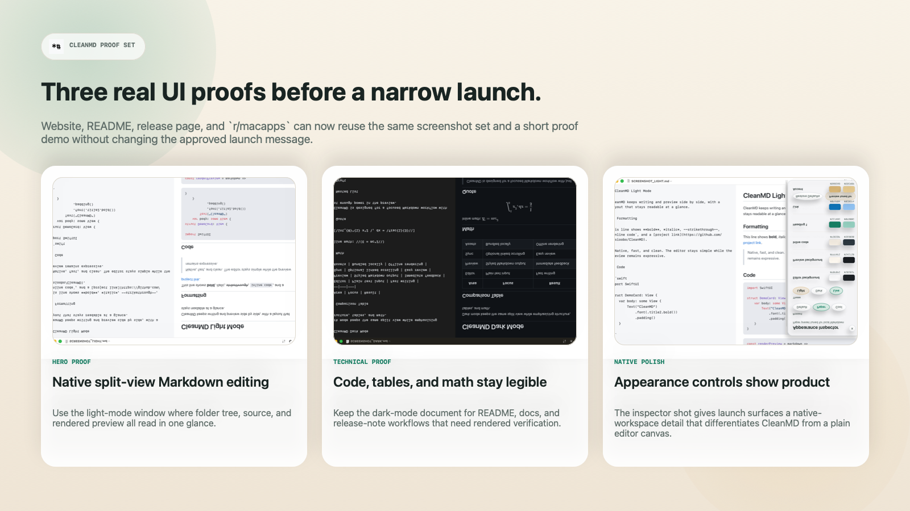

# CleanMD v0.10.0

## Highlights

- Docked **Appearance Inspector** that behaves like a native right-side workspace panel
- Faster Figma-like color controls with inline HEX editing and safer delayed persistence
- Built-in **Paper** and **Cool** appearance presets for both light and dark themes
- Preview handling is more reliable for local links, local images, unicode paths, and literal markdown blocks

## Included

- Native macOS split editor and live preview workflow
- Offline bundled Markdown, syntax highlighting, and math rendering assets
- Folder and history navigation in the sidebar
- GitHub Actions CI plus smoke-test coverage for preview, palettes, and window behavior

## Launch Proof Assets

Use the publish-ready launch variants when you update the website, README, release page, or `r/macapps`.

- Short demo: [`docs/assets/demo/cleanmd-proof-demo.mp4`](docs/assets/demo/cleanmd-proof-demo.mp4)
- Reddit proof sheet: [`docs/assets/launch/rmacapps-proof-grid.png`](docs/assets/launch/rmacapps-proof-grid.png)
- Surface map: [`docs/launch-assets.md`](docs/launch-assets.md)

## Platform

- macOS 13 or later

## Notes

- Packaged builds are currently created locally and ad-hoc signed.
- The app is not notarized yet, so macOS Gatekeeper may show a warning on first launch.
